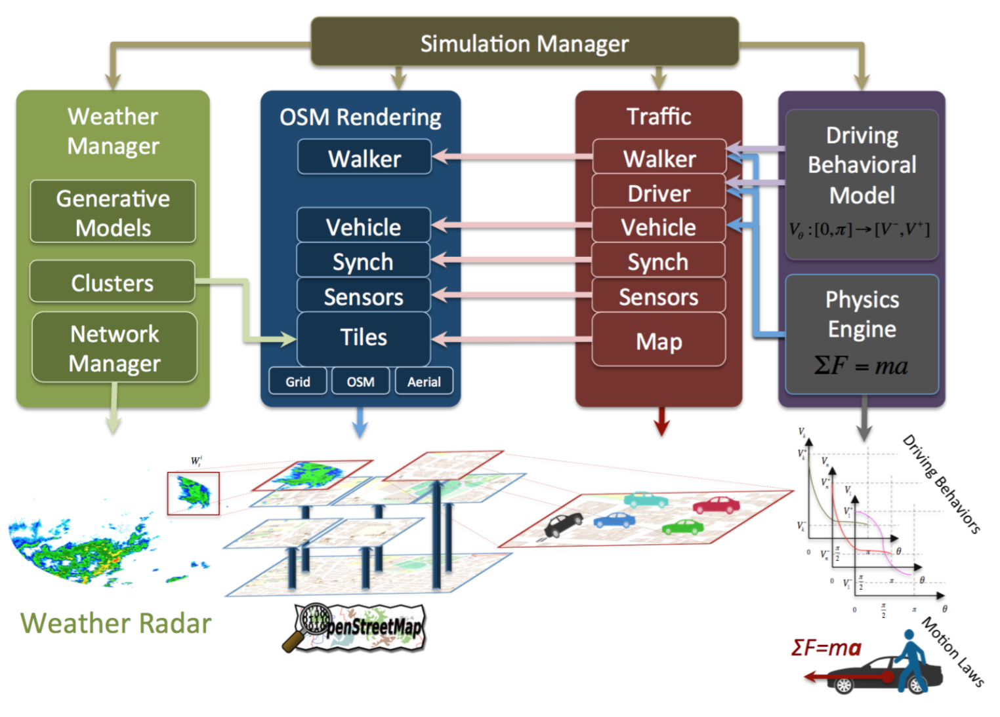
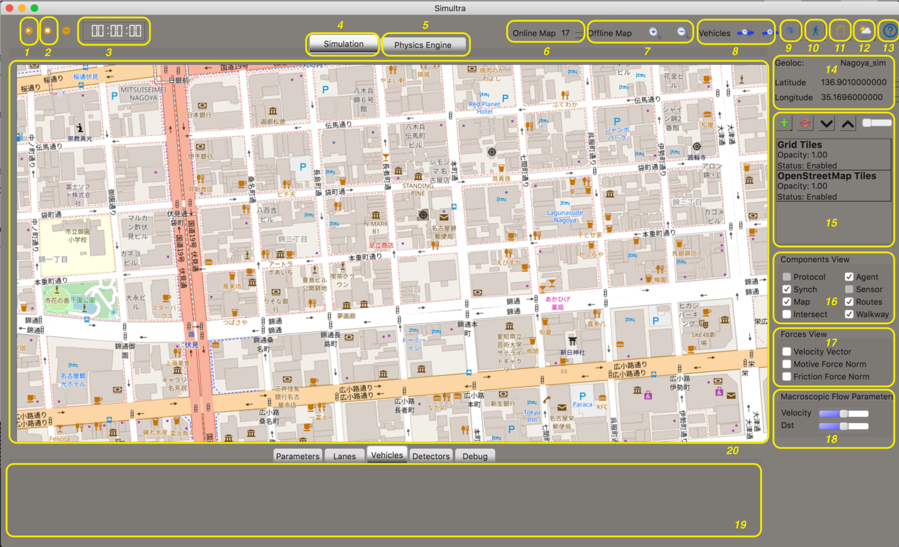
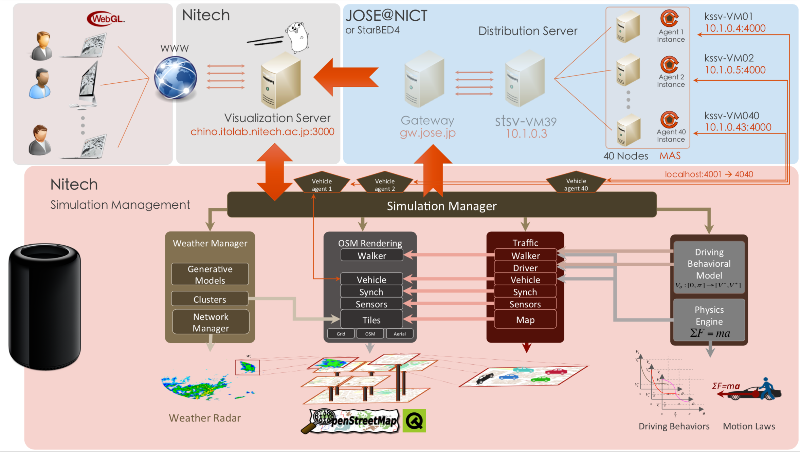
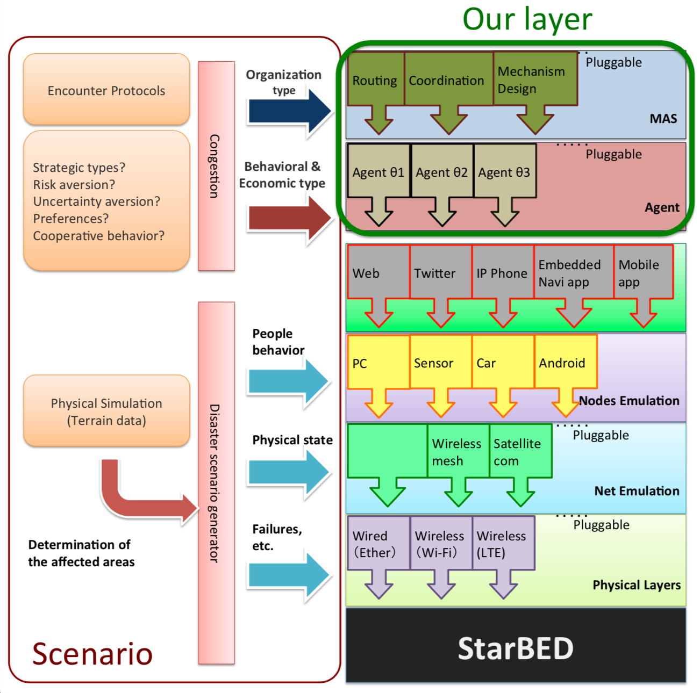

<p align="center">
  
</p>

<h1 align="center">Simultra</h1>

<p align="center">
  <strong>A multiagent hybrid simulator for large-scale road traffic</strong><br/>
  Built with Qt/C++ · Powered by OpenStreetMap
</p>

<p align="center">
  <a href="https://travis-ci.org/raviq/Simultra"></a>
  <a href="https://www.gnu.org/licenses/gpl-3.0"></a>
  
</p>

<p align="center">
  <a href="https://www.youtube.com/watch?v=6vsIEchAmt4&feature=youtu.be">🎬 Watch the demo (AAMAS 2016)</a>
</p>

---

## Overview

Simultra is an open-source road traffic simulator that seamlessly combines **microscopic** and **mesoscopic** simulation models into a single multiagent framework. It is designed to handle large real-world roadmaps in real-time:

- **Mesoscopic model** handles large-scale map regions efficiently using an event-based approach.
- **Microscopic model** provides detailed, agent-based physical simulation for complex traffic interactions (intersections, lane changes, etc.).
- A hybrid engine resolves concurrency issues and manages smooth transitions between the two scales.

### Key Features

- 🚗 **Programmable agents** — emulate vehicles, drivers, and intelligent traffic signals with configurable behaviors.
- 🗺️ **Real-world maps** — render and simulate on actual road networks via [OpenStreetMap](https://www.openstreetmap.org).
- 🌧️ **Weather overlay** — layer precipitation radar data on top of the traffic simulation.
- ⚡ **Real-time performance** — designed for large-scale maps without sacrificing interactivity.

### Architecture

<p align="center">
  
</p>

---

## Getting Started

### Prerequisites

| Dependency | Version |
|---|---|
| **Qt** | 5.11.2+ |
| **C++ standard** | C++11 |
| [Readosm](https://www.gaia-gis.it/gaia-sins/readosm-sources) | 1.0.0e |
| [MapGraphics](https://github.com/raptorswing/MapGraphics) | 1.0 |

### Build

**1. Build MapGraphics**

```bash
cd mapgraphics/
qmake MapGraphics.pro
make
```

**2. Build Readosm**

```bash
cd readosm/
make
```

**3. Build Simultra**

```bash
qmake simultra.pro
make
```

The compiled binary will be at `build/simultra.app`.

---

## Project Structure

```
Simultra/
├── kore/              # Core simulation engine
├── gui/               # UI components (roads, vehicles, traffic layers)
│   └── images/        # Image manipulation routines
├── build/             # Compiled binary + object files
├── resources/
│   ├── config/        # Configuration files & simulation scenarios
│   └── RadarImages/   # Precipitation overlay images
├── utils/             # Debug, logging, geometry utilities
├── mapgraphics/       # MapGraphics library source
├── readosm/           # Readosm library source
├── simultra.pro       # qmake project file
└── Makefile
```

---

## Usage

### Setting Up a Simulation

Configuration files live in `resources/config/`. Follow these steps:

**1. Get your map**
Download an area from [openstreetmap.org/export](https://www.openstreetmap.org/export) and save it as `map.osm`.

**2. Define the road topology** in `simx_map.xml`.

**3. Define the scenario** in `simx_simulation.xml`. Each vehicle is specified as:

```xml
<Vehicle type="TypeX">
  <Location>450 440</Location>
  <Direction>0</Direction>
  <Driver type="Slow1">
    <Lane>
      <Intersections>A B C D E</Intersections>
    </Lane>
  </Driver>
</Vehicle>
```

**4. Configure vehicle & driver types** in `types.xml`:

```xml
<!-- Vehicle: mass, wheelbase, engine force, appearance -->
<VehicleType name="TypeX">
  <Image>:/images/bluecar.png</Image>
  <Mass>1800.0</Mass>
  <Wheelbase>1</Wheelbase>
  <MotForce>5000</MotForce>
</VehicleType>

<!-- Driver: behavioral velocity parameters -->
<DriverType name="SlowType">
  <TurnVelocity>2</TurnVelocity>
  <StraightVelocity>12</StraightVelocity>
</DriverType>
```

**5. Add weather data** (optional) — place radar `.gif` images in `RadarImages/`. Sample images from the [Japan Meteorological Agency](https://www.jma.go.jp/jma/indexe.html) are included.

**6. Review `config.h`** for global simulation parameters (map center, zoom defaults, etc.).

### Running the Simulator

Launch the built binary. The GUI provides full interactive control:

<p align="center">
  
</p>

| # | Control | # | Control |
|---|---|---|---|
| 1 | Play / Pause | 11 | Pan the map |
| 2 | Stop simulation | 12 | Toggle precipitation overlay |
| 3 | Simulation clock | 13 | About Simultra |
| 4 | OSM view | 14 | Simulation area |
| 5 | Physics engine view | 15 | Layer order & opacity |
| 6 | Zoom (OSM) | 16 | Simulation components |
| 7 | Zoom (Physics) | 17 | Vehicle forces (physics view) |
| 8 | Vehicle size +/− | 18 | Flow parameters |
| 9 | Center map | 19 | Traces & mobility data |
| 10 | Pedestrian mode | 20 | Main viewport |

---

## Integration

Simultra has been adapted and deployed in other research projects:

**Pipelined distributed architecture** — [itolab-hayashi-rafik/Simultra](https://github.com/itolab-hayashi-rafik/Simultra)

<p align="center">
  
</p>

**Large-scale testbed** — Deployed on [StarBED](http://starbed.nict.go.jp/en/index.html) (NICT)

<p align="center">
  
</p>

---

## Roadmap & Ideas

- [ ] Consolidate configuration files into a single JSON or auto-generate them in a pre-simulation phase.
- [ ] Support drag-and-drop vehicle placement on the OSM map.
- [ ] Integrate traffic light data from OSM.
- [ ] Fetch precipitation data dynamically via a weather API.
- [ ] Improve coordinate conversion between (lat, lon) and (x, y).
- [ ] Merge `readosm` and `json.c` utilities.
- [ ] Expand test coverage.

---

## Citation

If you use Simultra in your research, please cite one of the following:

```bibtex
@inproceedings{hadfi2016multilayered,
  title     = {Multilayered Multiagent System for Traffic Simulation},
  author    = {Hadfi, Rafik and Ito, Takayuki},
  booktitle = {Proceedings of the International Conference on Autonomous Agents \& Multiagent Systems (AAMAS)},
  year      = {2016}
}

@inproceedings{hadfi2017pipeline,
  title     = {A Pipeline Multiagent Architecture for Road Traffic Simulation},
  author    = {Hadfi, Rafik and Hayashi, Masayuki and Ito, Takayuki},
  booktitle = {Proceedings of ITS World Congress},
  year      = {2017}
}

@inproceedings{ito2018holonic,
  title     = {An Implementation of Large-Scale Holonic Multi-agent Society Simulator and Agent Behavior Model},
  author    = {Ito, Takayuki and Otsuka, Takanobu and Imaeda, Teruyoshi and Hadfi, Rafik},
  booktitle = {Pacific Rim International Conference on Artificial Intelligence (PRICAI)},
  publisher = {Springer},
  year      = {2018}
}

@inproceedings{hadfi2016holonic,
  title     = {Holonic Multiagent Simulation of Complex Adaptive Systems},
  author    = {Hadfi, Rafik and Ito, Takayuki},
  booktitle = {International Conference on Practical Applications of Agents and Multi-Agent Systems (PAAMS)},
  publisher = {Springer},
  year      = {2016}
}
```

---

## Contributing

Contributions, bug reports, and ideas are welcome! Feel free to [open an issue](https://github.com/raviq/Simultra/issues) or submit a pull request.

---

## License

Distributed under the **GNU General Public License v3.0**. See [`LICENSE`](LICENSE) for details.

© 2016–2018 [Rafik Hadfi](mailto:rafik.hadfi@gmail.com)
